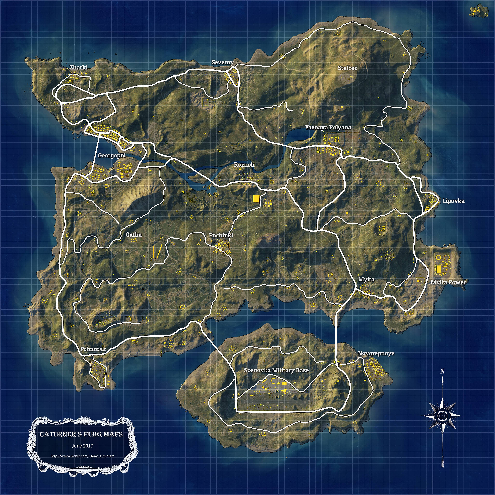
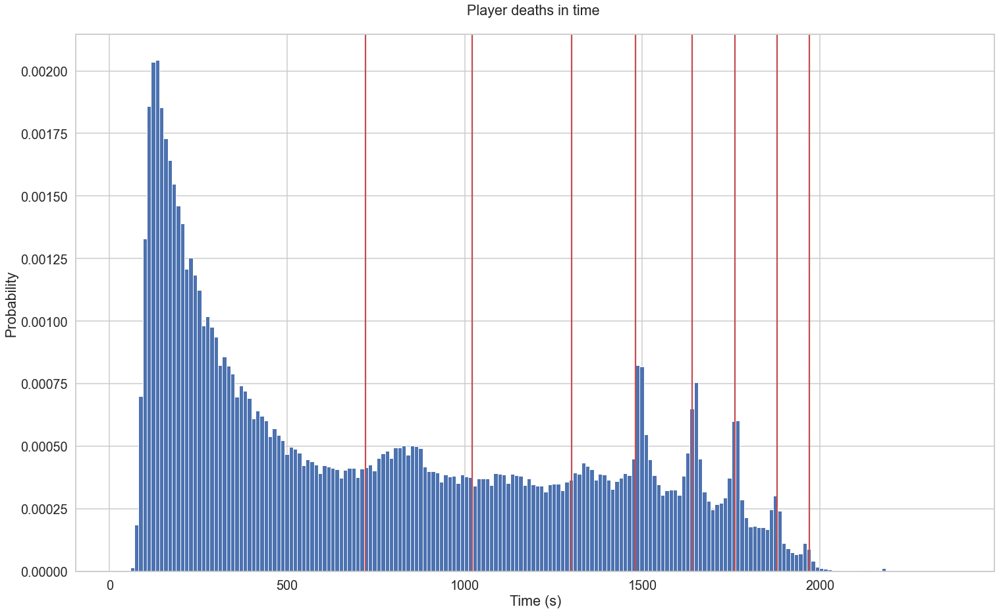
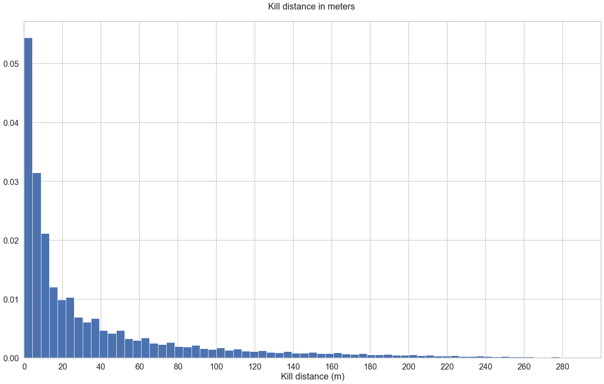

# Analysis of PUBG kills from over 700,000 matches.

PUBG is the first of what is now called the Battle Royale genre of videogames. In it, 100 players fight inside a digital landscape, with the last one or team standing being the winner. The players parachute onto the landscape from a plane and then have to search the buildings for guns, melee weapons, ammunition, and bombs with which to fight. With the time the playable area decreases, and slowly shirnks into smaller and smaller circles. Each match lasts around 33 minutes.

The data was required from: [Kaggle](https://www.kaggle.com/skihikingkevin/pubg-match-deaths/). It contains over 700,000 matches, each including around 90 players. The main map (Erangel) is an 8 km x 8 km square, providing a 64km2 play area. The dataset includes the X,Y coordinates (all in in-game coordinates and need to be linearly scaled to be plotted on square erangel) of the killed player, and one who shot him. The coordinate min,max are 0,800000 respectively.

## EDA

The dataset provides data about when the player was killed during the game, where he died and where he wsa shot from.
The following histogram provides data about the time when people tend to end their games. Each vertical red line shows the new "circle" reducing the play area. It is clearly visible how that affects the death-rate of players.

Using the hypot function - "Given the "legs" of a right triangle, return its hypotenuse." - the kill's ditance can be calcualted.

